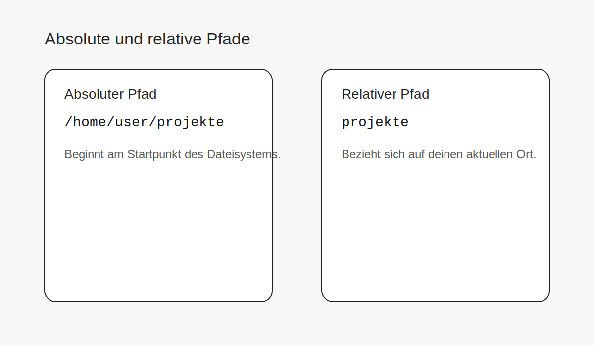

## Was ist ein Pfad?

Ein Pfad beschreibt den **Weg zu einem Ordner oder zu einer Datei**.

Pfade sind im Terminal wichtig, weil sehr viele Befehle mit Orten im Dateisystem arbeiten.

## Absolute Pfade

Ein absoluter Pfad beginnt am Startpunkt des Dateisystems.

```bash
/home/user/projekte
```

Er ist vollständig und eindeutig.

## Relative Pfade

Ein relativer Pfad hängt davon ab, **wo du dich gerade befindest**.

```bash
projekte
```

oder

```bash
../bilder
```

Relativ bedeutet also: vom aktuellen Arbeitsverzeichnis aus gedacht.

## Warum ist das wichtig?

Wenn du Pfade verstehst, kannst du:

- sicherer navigieren
- Befehle besser lesen
- Fehler schneller erkennen
- strukturierter mit Dateien und Ordnern arbeiten

## Typische Denkfehler

### „Dieser Pfad sieht kürzer aus, also ist er besser.“

Nicht unbedingt.  
Relative Pfade sind oft kürzer, aber absolute Pfade sind eindeutiger.

### „Ich kann jeden Pfad überall gleich eingeben.“

Nur absolute Pfade funktionieren unabhängig davon, wo du gerade bist.

### „Das ist doch nur ein Ordnername.“

Manchmal ja, aber im Terminal ist der **Kontext** entscheidend.

## Praktische Regel

Wenn du dir unsicher bist, prüfe zuerst mit `pwd`, wo du bist.  
Dann kannst du viel besser einschätzen, ob ein relativer Pfad gerade sinnvoll ist.
