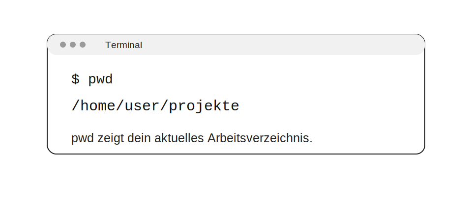

# pwd verstehen



## Worum geht es?

Der Befehl `pwd` zeigt dir, **wo du dich gerade im Dateisystem befindest**.  
Das ist einer der kleinsten Linux-Befehle, aber einer der nützlichsten.

Gerade am Anfang verliert man im Terminal schnell die Orientierung.  
Wenn du nicht mehr sicher bist, in welchem Ordner du arbeitest, hilft `pwd` sofort weiter.

## Was bedeutet `pwd`?

`pwd` steht für **print working directory**.

Gemeint ist damit dein **aktuelles Arbeitsverzeichnis**.  
Also genau der Ordner, in dem du dich gerade befindest und in dem viele andere Befehle standardmäßig arbeiten.

## Das einfachste Beispiel

```bash
pwd
```

Eine typische Ausgabe sieht so aus:

```bash
/home/user/projekte
```

Das bedeutet:  
Du arbeitest gerade im Ordner `projekte`, der im Home-Verzeichnis von `user` liegt.

## Warum ist `pwd` so wichtig?

Viele Terminal-Befehle hängen davon ab, **wo du dich gerade befindest**.

Zum Beispiel:

- `ls` zeigt die Inhalte des aktuellen Ordners
- `cd` wechselt von deinem aktuellen Ort weiter
- `mkdir` legt neue Ordner an deinem aktuellen Ort an
- Dateibefehle wie `cp`, `mv` oder `rm` wirken oft relativ zum aktuellen Verzeichnis

Darum ist `pwd` wie ein kurzer Standort-Check.

## Wann solltest du `pwd` benutzen?

`pwd` ist besonders praktisch:

- wenn du viele `cd`-Befehle hintereinander genutzt hast
- wenn du in einer tiefen Ordnerstruktur arbeitest
- wenn du vor einem Datei- oder Löschbefehl sicher sein willst
- wenn du im Unterricht oder in einer Anleitung denselben Pfad nachvollziehen möchtest

## Ein kleines realistisches Beispiel

Stell dir vor, du arbeitest nacheinander so:

```bash
cd dokumente
cd linux
cd shell
pwd
```

Dann könnte die Ausgabe so aussehen:

```bash
/home/user/dokumente/linux/shell
```

Jetzt weißt du sofort, an welchem Ort du bist.

## `pwd` und Pfade

`pwd` gibt normalerweise einen **vollständigen Pfad** aus.

Das ist hilfreich, weil du damit:

- deinen aktuellen Ort exakt siehst
- absolute Pfade besser verstehst
- Fehler beim Navigieren schneller erkennst


## Der Unterschied zwischen logisch und physisch

Hier wird `pwd` etwas technischer, aber es lohnt sich.

Es gibt zwei wichtige Sichtweisen auf deinen aktuellen Pfad:

### 1. Logischer Pfad

Der logische Pfad orientiert sich daran, **wie du dich dorthin bewegt hast**.

Wenn symbolische Links im Spiel sind, kann dieser Pfad so aussehen, wie du ihn „siehst“, auch wenn im Hintergrund ein anderer echter Ort gemeint ist.

### 2. Physischer Pfad

Der physische Pfad löst symbolische Links auf und zeigt den **tatsächlichen Ort im Dateisystem**.

## Die Optionen `-L` und `-P`

### `pwd -L`

```bash
pwd -L
```

Das zeigt die **logische** Sicht auf deinen Pfad.

### `pwd -P`

```bash
pwd -P
```

Das zeigt die **physische** Sicht und löst symbolische Links auf.

## Warum dieser Unterschied in der Praxis wichtig ist

Am Anfang ist das oft noch nicht entscheidend.  
Später wird es wichtig, wenn du mit symbolischen Links arbeitest, zum Beispiel:

- bei Entwicklungsumgebungen
- in Projektordnern
- bei Systempfaden
- in Kurs- oder Serverstrukturen

Dann kann `pwd -L` etwas anderes anzeigen als `pwd -P`.

## Ein gedankliches Beispiel

Du wechselst in einen Ordner, der eigentlich nur ein symbolischer Link ist.

Dann kann Folgendes passieren:

```bash
pwd -L
```

zeigt:

```bash
/home/user/projekt-link
```

während

```bash
pwd -P
```

zeigt:

```bash
/var/data/projekte/projekt-a
```

Beides kann im selben Moment „richtig“ sein, aber aus unterschiedlicher Sicht.

## Wichtig für Shells

In der Praxis gibt es noch eine kleine Besonderheit:

Viele Shells haben ein eingebautes eigenes `pwd`.  
Darum kann sich das Verhalten leicht unterscheiden, je nachdem ob du das Shell-Builtin oder das externe Programm nutzt.

Für Lernzwecke ist das kein Problem.  
Wichtig ist nur: Das Grundprinzip bleibt gleich — `pwd` zeigt deinen aktuellen Arbeitsort.

## Typische Anfängerfehler

### „Ich dachte, ich bin woanders.“

Das passiert sehr oft nach mehreren `cd`-Schritten.  
Lösung: einmal `pwd`.

### „Mein Befehl funktioniert nicht.“

Manchmal liegt das gar nicht am Befehl selbst, sondern daran, dass du im falschen Ordner bist.

### „Der Pfad sieht anders aus als erwartet.“

Das kann bei symbolischen Links passieren.  
Dann lohnt sich der Vergleich zwischen `pwd -L` und `pwd -P`.

## Kurz zusammengefasst

`pwd` ist dein schneller Standort-Check im Terminal.

Es hilft dir:

- Orientierung zu behalten
- Pfade besser zu verstehen
- Fehler zu vermeiden
- sicherer mit dem Terminal zu arbeiten

## Merksatz

**Wenn du im Terminal nicht mehr sicher bist, wo du bist, frage zuerst `pwd`.**

## Mini-Übungen

### Übung 1

Wechsle in einen Ordner deiner Wahl und führe dann `pwd` aus.

Frage an dich:
- Welcher vollständige Pfad wird angezeigt?

### Übung 2

Nutze mehrere `cd`-Schritte hintereinander und prüfe danach mit `pwd`, ob du noch am erwarteten Ort bist.

### Übung 3

Wenn du später symbolische Links kennenlernst, vergleiche:

```bash
pwd -L
pwd -P
```

und beobachte, ob sich die Ausgabe unterscheidet.

## Nächste passende Themen

- `cd verstehen`
- `Pfade verstehen`
- `ls verstehen`
- `Dateien und Ordner`
